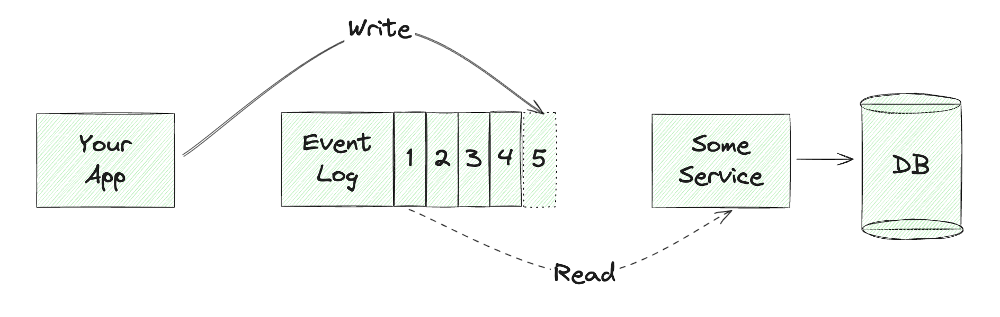

+++
title = "How Event Sourcing Solves Real-World Problems"
date = "2024-02-27"
+++

I'm curretly joining to new project after finishing my previous one. I work at software house with multiple teams, each consisting of small number of members (5 engineers-either backend or frontend). The project leader has assigned me the task of exploring the concept of Event Sourcing. Since our project team is small, I need to design an Event Sourcing system that can be easily maintained by a small team. Additionally, the system must preserve historical data, enabling us to view user information based on its state over time.

## What is Event Sourcing?

Martin Flower will [explain](https://martinfowler.com/eaaDev/EventSourcing.html) what it is.

> Event Sourcing ensures that all changes to application state are stored as a sequence of events. Not just can we query these events, we can also use the event log to reconstruct past states, and as a foundation to automatically adjust the state to cope with retroactive changes.


With that definition, you might be asking, "What is it really?" Let me break it down further.

Event Sourcing is an architectural pattern in which state changes in an application are stored as a sequence of immutable events, rather than by directly updating a database. Instead of merely storing the latest state of an entity (such as an order or a user), you record every change (event) that occurs.

Here's a simplified summary of how Event Sourcing works:

- Events as the **source of truth**, every change to an entity is recorded as an event (e.g., `OrderCreated`, `OrderPaid`, `OrderShipped`). These events are immutable—once stored, they cannot be changed.

- Rebuilding state from events, the current state of an entity (e.g., an order) is derived by replaying all the events in sequence. This process allows you to **reconstruct the history** of an entity at any point in time.

- Appending instead of updating, rather than modifying a row in a database, **new events are appended to an event log**. This approach guarantees a complete audit trail of changes.




## What Can Event Sourcing Do?

Event sourcing offers amount of benefits that can enhance both the reliability and flexibility of your application. Here's what it can do for you:

### Complete Audit Trial

Greg Young [mentioned](https://www.youtube.com/watch?v=8JKjvY4etTY) that his initial interest in event sourcing stemmed from the need to implement auditing. Every change in your application's state is recorded as an immutable event. Such detailed logging is invaluable for compliance and auditing purposes. You can demonstrate with certaintly how data has evolved over time, which is crucial in regulated industries.

### State Reconstruction

Since the current state is built by replaying the event log, you can reconstruct the state of any entity at any given point in time. Imagine being able to "time travel" through your application's history to understand how a particular state was reached. In the event of an error or anomaly, you can analyze the sequence of events leading up to an issue, making it easier to pinpoint and resolve problems like a forensic analysis.

### Improved Debugging

With a detailed event log, you have access to the full history of state changes. This granular insight allows you to trace back through each step to identify where things where wrong. Instead of guessing which update might have caused an issue, you can methodically replay events to reproduce the problem, significantly reducing debugging time.

### Flexibility for Future Changes

As your business evolves, so do your requirements. With event sourcing, you can modify the interpretation of past events without altering the underlying data. This means you can introduce new business rules or update processes without disrupting the historical record.

For decoupled system evolution, the separation between event storage and state presentation allows different parts of your system to evolve independently, reducing the risk of system-wide failures when making changes.

### Seamless Integration with Event-Driven Architectures

Event sourcing aligns seamlessly with modern, event-driven architectures. Each microservice can listen to the event log to keep its own state updated, fostering better communication and synchronization across distributed systems. By decoupling state management from direct database updates, event sourcing enables more scalable and resilient architectures that can handle high loads and distributed processing more effectively.

### Enhanced Data Integrity

Since events are never overwritten, you always have a full, reliable backup of every state change. This makes it much easier to recover from data corruption or system failures. In the event of a catastrophic failure, you can rebuild your entire system state by replaying the event log, ensuring minimal data loss and faster recovery times.


## What Might Event Sourcing Look Like in My Practice?

Based on my experience, I'll use the **order domain** as an example to demonstrate how to implement event sourcing in a straightforward and maintainable manner.

Event sourcing revolves around recording every change as an immutable event rather than simply updating a current state. In our order domain, this means that operations like `creating`, `paying for`, and `shipping` an order are all represented as distinct events. These events form the single source of truth and can be replayed to reconstruct the current state of any order.

Let's walk through a simplified example of how this can be achieved.

### Step 1: Setting Up the Event Store

Create a table to store all order-related events.

```sql
CREATE TABLE order_events (
    id UUID PRIMARY KEY DEFAULT gen_random_uuid(),
    order_id UUID NOT NULL,
    event_type VARCHAR(255) NOT NULL,
    event_data JSONB NOT NULL,
    created_at BIGINT DEFAULT extract(epoch FROM now()) * 1000
);
```

This table logs each event with its payload and timestamp.

### Step 2: Define Event Types in Code

Create a simple class to represent an event. This class captures the order ID, event type, payload, and timestamp.

```js
class Event {
  constructor(orderId, eventType, eventData) {
    this.orderId = orderId;
    this.eventType = eventType;
    this.eventData = eventData;
    this.createdAt = Date.now();
  }
}
```

### Step 3: Storing Events

When an order event occurs (for example, when creating an order), store the event in the event store.

```js
async function storeEvent(event) {
  const query = `
    INSERT INTO order_events (order_id, event_type, event_data, created_at)
    VALUES ($1, $2, $3, $4)
  `;
  const values = [
    event.orderId,
    event.eventType,
    JSON.stringify(event.eventData),
    event.createdAt
  ];
  await db.query(query, values);
}

// Example: Creating an order
async function createOrder(orderId, eventData) {
  const event = new Event(orderId, "OrderCreated", eventData);
  await storeEvent(event);
}
```

### Step 4: Rebuilding State from Events

To reconstruct the current state of an order, replay all its events in order.

```js
async function getOrderState(orderId) {
  const query = `
    SELECT event_type, event_data
    FROM order_events
    WHERE order_id = $1
    ORDER BY created_at ASC
  `;
  const result = await db.query(query, [orderId]);
  
  let state = { orderId };

  result.rows.forEach(row => {
    const { event_type, event_data } = row;
    switch (event_type) {
      case "OrderCreated":
        state = { ...state, ...event_data, status: "Created" };
        break;
      case "OrderPaid":
        state = { ...state, ...event_data, status: "Paid" };
        break;
      case "OrderShipped":
        state = { ...state, ...event_data, status: "Shipped" };
        break;
      // Handle additional event types as needed.
    }
  });

  return state;
}
```

### Step 5: Projections for Faster Queries

Replaying events for every query can be slow. Maintain a read-optimized projection (a summary table) for quick access to the current order state.

**1. Create the Projection Table**

```sql
CREATE TABLE orders (
    order_id UUID PRIMARY KEY DEFAULT gen_random_uuid(),
    customer_id UUID NOT NULL,
    amount DECIMAL(10,2),
    status VARCHAR(20)
);
```

**2. Update the Projection**

After processing an event, update the projection table.

```js
async function projectOrderState(orderState) {
  const query = `
    INSERT INTO orders (order_id, customer_id, amount, status)
    VALUES ($1, $2, $3, $4)
    ON CONFLICT (order_id)
    DO UPDATE SET amount = $3, status = $4
  `;
  const values = [
    orderState.orderId,
    orderState.customerId,
    orderState.amount,
    orderState.status
  ];
  await db.query(query, values);
}
```

### Walk Through Summary

- **Event Store**, captures all order events (creation, payment, shipping) with payloads and timestamps.

- **Event Class**, represents each event in code.

- **Storing Events**, append events to the `order_events` table instead of updating the order directly.

- **Rebuilding State**, reconstruct an order's current state by replaying its events.

- **Projections**, use a separate table (`orders`) for fast, read-optimized queries.

This optimized approach ensures that every order change is recorded as an event, enabling you to reconstruct the full history and current state while also supporting efficient querying with projections. You can update these projections on a scheduled basis, and if real-time data is required, simply query the events table for the latest entries based on the ID. For a versatile identifier that incorporates time information, I recommend using a time-series UUID—such as [uuidv7](https://en.wikipedia.org/wiki/Universally_unique_identifier#Version_7_(timestamp_and_random)).
