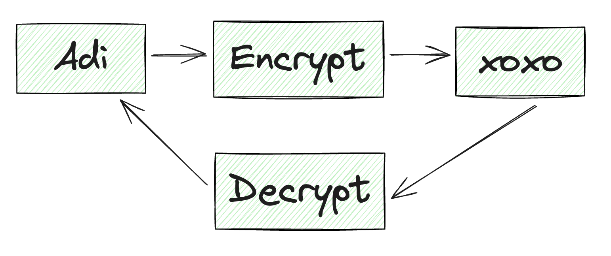
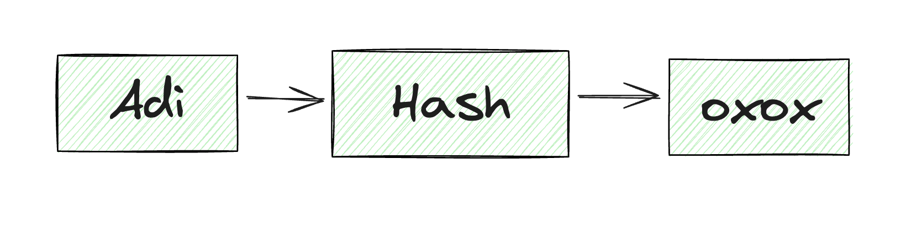

+++
title = "How to Handle Passwords Securely Usually in My Projects"
date = "2024-02-14"
+++

Before to the best practice of me to handle passwords in my projects. I have always heard that "we need to encrypt our password", but the definition is completely wrong. Actually, we don't need to encrypt our password. Maybe my argument will make people angry: "so you can know my password if you don't encrypt it". No, otherwise, I will know your password if I encrypt it. Hmm why? That's why you need to know about encryption and hashing.

### What is Encryption?

Encryption is the process of converting a readable message to an unreadable message (chipertext). The process of encryption is called Encoding. The chipertext obtained from the encryption can easily be converted back to readable message using encryption key, it's called Decoding.

### What is Hashing?

Hashing is the process of converting a readable message to an unreadable message (hash key). The readable message cannot be retrieved from a hash key by any means. So, generally, to verify the readable message, we need to compare its with the hash key until they match.

### What Should We Use?

Based on the definitions above, I use hashing to protect the password in my project. That's because the hash key cannot be converted back into a readable message; it's a good fit for the password use case. We need to protect the user's password even from the engineers working on the project. That's why hashing is the best practice to protect it.

There are many hash functions (function for creating hash key). Many of you have probably heard of [MD5](https://en.wikipedia.org/wiki/MD5), a widely used hash function producing a 128-bit has value. However, MD5 isn't the recommendation hash function for hashing passwords, because it's currently vulnerable to brute-force attacks.

### bcrypt, what is it?

[bcrypt](https://en.wikipedia.org/wiki/Bcrypt) is a password-hashing function designed by Niels Provos and David Mazières. It's intended to slow down brute-force attacks, Although its design is older and doesn't fully take advantage of modern hardware consedirations, bycrypt is realiable because it has been well-tested in numerous production systems. When your login domain become slow, you can adjust the cost factor (i.e., the number of iterations, expressed as 2^n) or upgrade your CPU. The default cost factor is 2^10, although this may vary depending on your frameworks.

### My Practice!

My practice depends on the project (tech lead, lol). In my journey, I have always used bcrypt, until I know about [argon2](https://en.wikipedia.org/wiki/Argon2). Argon2 is a newer algorithm that won the Password Hashing Competition in 2015. It's designed to be memory-hard, meaning it requires significant memory resources to compute, which makes it more resistant to attacks using GPU or specialized hardware (ASICs). It offers adjustable parameters for memory cost, time cost, and degree of parallesim, providing more flexibility to tailor its performance and security.
