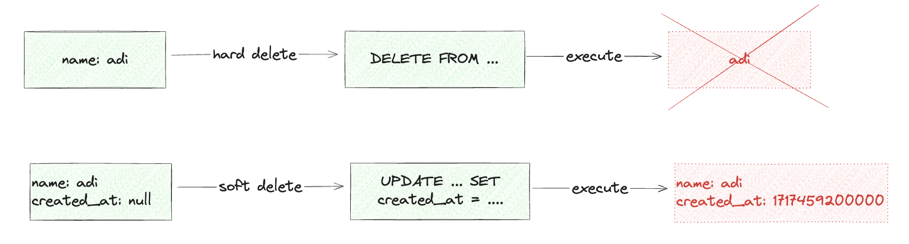
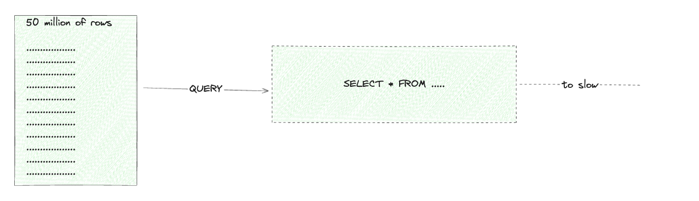
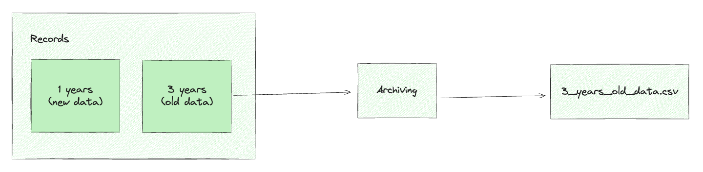
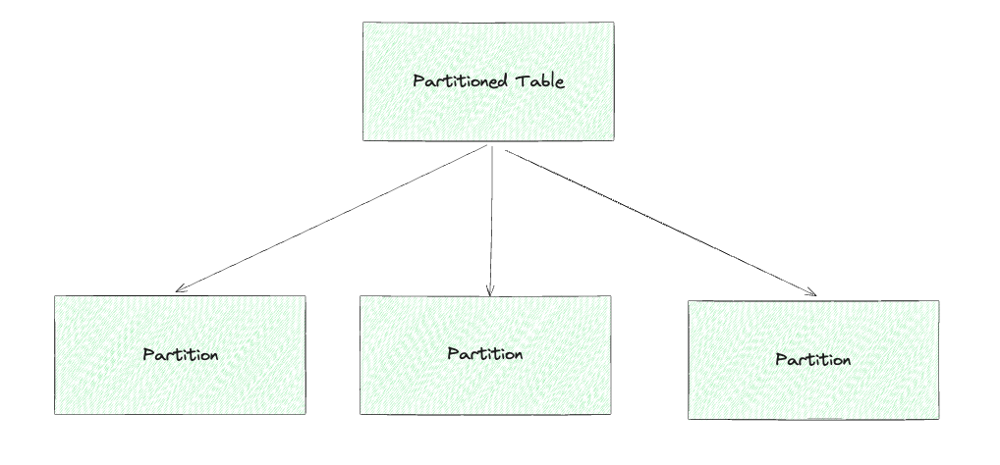
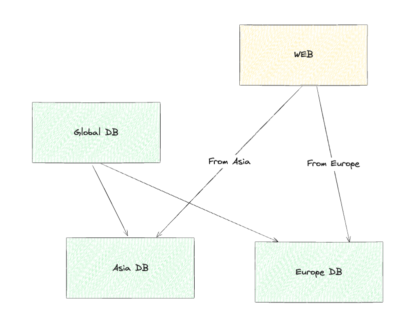

+++
title = "Data Deletion? No Thanks!"
date = "2024-03-05"
+++

A long time ago, like in a fairy tale, when I was an intern, my environment and I would always use `DELETE` on data, especially in relational databases. After a long journey to the west (moving to my current company), I gained knowledge about **soft delete**. It became an addiction, and now I wonder--what the hell is delete? I hate delete! 🤬.

Why do I hate deleting data from my database? Well, not entirely--I have a love-hate relationship with it. It comes a lot of pain points, such as:

1. I can't debug certain data because it's permanently deleted.
2. I lose historical records that might be useful for audits and analytics.
3. Deleting related data in relational database can lead to integrity issues.
4. Accidental deletions are irreversible without a proper backup.

This is why **soft delete** feels like a better approach in many cases! 🚀.

We have two methodologies for deleting data: **hard delete** and **soft delete**.

The simple definition of **hard delete** is permanently removing data using the `DELETE` statement in a table, for example. On the other hand, **soft delete** removes data only at the surface level, not in the background. This can be archived by adding a column like `deleted_at` (nullable and filled with a timestamp) or `is_deleted` (a boolean flag).

I personally love using `deleted_at` beause it records when the data was deleted, providing better traceabillity. 

Besides that, I prefer **soft delete** because _storage is much cheaper_ to scale compare to memory or CPU. That's why I compromise with It.

I have two tricks for **soft delete**:

1. If you have master data--like countable data--you can predict its maximum size. For example, if your business operates in Indonesia, the maximum number of users might be around 270 million. In such cases, **soft delete** is a good choice.
2. On the other hand, if you're dealing with historical data, you can use **hard delete** because this type of data is uncountable. For example, order records grow exponentially based on user activity, making **hard delete** a more practical option.

But I really want to use soft delete for all my data, even historical data—I don't care about storage or anything else!

You can record as much data as you want, but keep in mind that the larger the table, the slower the queries. For example:

1. Indexing issues-- As the table grows, indexes become less efficient, making queries slower.
2. Join performance-- Queries that join large tables (especially with `WHERE deleted_at IS NULL`) can become significantly slower.  
3. Storage bloat-- Even though storage is cheap, a massive table can still impact performance due to fragmentation and increased I/O operations.
4. Archival challenges-- Without proper cleanup, old data lingers forever, making maintenance harder.

To mitigate these issues, you can use **partitioning**, **archiving**, or **sharding** for better performance.

## Archiving

Archiving is a simple method to address these issues. It involves moving old data to another storage (e.g., CSV files, a different database, or even a data dump). This ensures that your production database only contains the records needed by users or the business domain.

For example, in a marketplace, warranty claims might expire after 2 or 3 years. After that period, you can archive the order data since users no longer need it for warranty claims. This keeps your active database lean while still preserving historical records.

## Partitioning

Partitioning divides records within a table into smaller, more manageable pieces based on specific criteria, such as date, region, or status. This improves query performance by allowing the database to scan only relevant partitions instead of the entire table.

For example, if you have an orders table, you can partition it by year. Queries searching for recent orders will only scan the latest partition, making them significantly faster.

## Sharding

The hardest one is sharding. Sharding is another technique for handling large datasets by distributing data across multiple databases or servers. Unlike partitioning, which splits data within a single database, sharding spreads data across multiple independent databases. Each shard operates as a standalone database, handling a subset of the data.

For example, if you run a global e-commerce platform, you can shard user data by region. Users from Asia are stored in one database, while users from Europe are stored in another. This prevents any single database from becoming a bottleneck, improving scalability and performance.

---

So, what should I use? **It depends** (the magic words) on your project, team, and conditions. We can use any of these approaches—there's nothing wrong with the concept itself—but we need to adapt and understand how to apply it in our specific situation.

~ Salam Hangat, Adi. 
