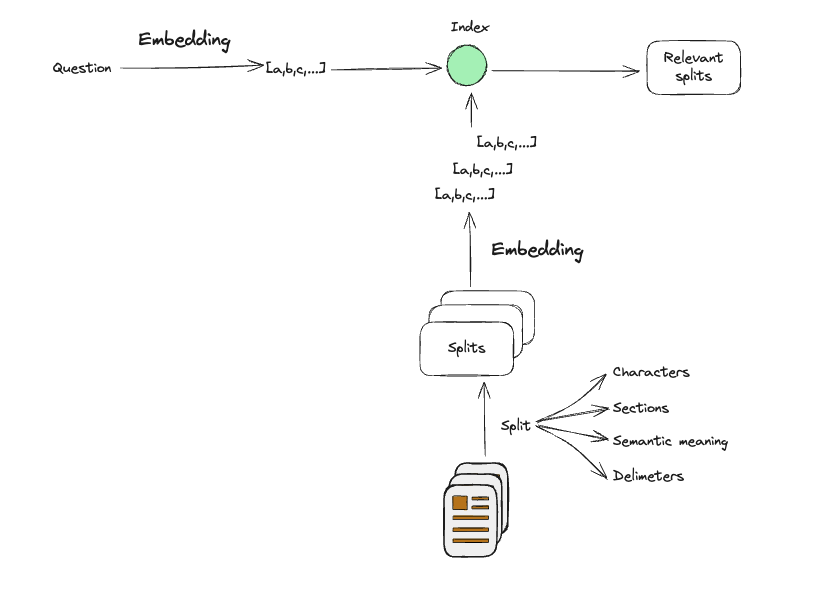

+++
title = "Retrieval-Augmented Generation (RAG): Enhancing AI Responses with External Knowledge"
date = "2025-02-17"
+++

More than [95% of the world's data is private](https://x.com/RihardJarc/status/1778082161595208124)-either enterprise or personal. We can feed that data to LLM. 

RAG is built on a simple idea: LLMs are becoming the core of a new operating system, and integrating private data from external sources is key for processing. That’s the driving force behind RAG.

RAG stands for _**R**etrieval_, _**A**ugmented_, and _**G**eneration_, and it works in three main steps: **Indexing**, **Retrieval**, and **Generation**.


- **Indexing** involves organizing external data, like building large-scale databases. These databases could be relational, vector-based, or in other formats. The main goal is to structure the data in a way that allows it to be efficiently retrieved based on certain queries or heuristics.

- **Retrieval** is the process of fetching the most relevant documents or data based on an input, such as a question. The indexed data is searched, and the most pertinent information is selected.

- **Generation** is where the LLM takes the retrieved data and produces an answer grounded in that information. This allows the LLM to generate more accurate and contextually relevant responses.

This combination of indexing, retrieval, and generation is what makes RAG a powerful technology. It effectively combines the processing power of LLMs with the vast, often private, external data sources that hold most of the world’s important information.

## Indexing


The first step of indexing involves loading external documents into what is known as a retriever. The purpose of the retriever is simple: given an input question, it is designed to find documents that are relevant or related to the query. Establishing this relationship, relevance, or similarity is typically achieved using numerical representations of documents. The reason for using numerical representations is that comparing vectors—numerical values—is far easier than comparing free-form text.

Over the years, various methods have been developed to transform text documents into numerical representations, making them much easier to search.


One common method is the Bag of Words (BoW) approach, where documents are transformed into sparse vectors based on word frequency. In this method, each value in the vector represents the number of occurrences of a specific word. The vector is considered "sparse" because many of its values are zeros, due to the large vocabulary compared to the actual content of the document. Despite its simplicity, this method has proven highly effective for searching and retrieving documents.

More recently, machine-learned embedding methods have emerged. These methods convert a document into a compressed, fixed-length representation, called an embedding. These embeddings can be searched using advanced search algorithms designed to handle the compressed vector space efficiently.



To embed documents, three key steps are involved: **loading**, **splitting**, and **embedding**. First, the documents are **loaded** into the system. Then, they are typically **split** into smaller chunks because embedding models have a limited context window. Each chunk is then **embedded** into a vector representation that captures its semantic meaning.

Once the vectors are indexed, queries can be processed in the same way—by embedding them into vectors. This allows for efficient numerical comparisons using various retrieval methods to identify the most relevant documents based on their semantic similarity to the query.

## Retrieval


The indexing process structures documents to enable fast and efficient retrieval. To understand how retrieval works, imagine that each document's embedding is represented in a multi-dimensional space.

For simplicity, let’s assume the embedding space has just three dimensions. In this space:

1. Document Embeddings – Each document is mapped to a point based on its semantic meaning.
2. Query Embedding – When a user submits a search query, it is also embedded into the same space.
3. Similarity Search – The system retrieves the closest document embeddings to the query using similarity measures.

## Generation 

Once the most relevant documents are retrieved through the indexing and retrieval steps, the next task is to generate a meaningful response based on the retrieved data. This is where the power of large language models (LLMs) like GPT comes into play. The LLM synthesizes the retrieved information and generates a response that is coherent, accurate, and relevant to the user’s query.

The process of generation takes the context provided by the retrieved documents and uses it to generate a natural language response. This allows LLMs to not only recall factual information but also generate more nuanced and contextually rich answers, which would not be possible by relying solely on the model’s pre-trained knowledge.

This is an important distinction because it means LLMs powered by RAG are not limited to their initial training data. They have the ability to incorporate real-time, external data and generate responses that reflect the most current, relevant information available.


# Simple Walkthrough

This walkthrough will guide you through the core steps involved in setting up a basic Retrieval-Augmented Generation (RAG) pipeline, including the **Indexing**, **Retrieval**, and **Generation** stages. By following these steps, you can easily index external data, retrieve relevant information based on a query, and generate contextually accurate responses using a language model.

## 1. Indexing

The first step is **Indexing**, where you load your documents into a retriever and prepare them for later retrieval. This involves two important sub-steps: loading the documents and splitting them into manageable chunks that can be embedded into vectors.

### Loading documents

```python
import os
import getpass
from langchain_openai import OpenAIEmbeddings
from langchain_community.document_loaders import WebBaseLoader
from langchain_text_splitters import RecursiveCharacterTextSplitter
from langchain_chroma import Chroma
from langchain_openai import OpenAI
from langchain.chains import RetrievalQA

# Ensure OpenAI API Key is set
if not os.environ.get("OPENAI_API_KEY"):
    os.environ["OPENAI_API_KEY"] = getpass.getpass("Enter API key for OpenAI: ")

import bs4

bs4_strainer = bs4.SoupStrainer(["title", "h1", "h2", "h3", "p", "li", "code"])
loader = WebBaseLoader(
    web_paths=("https://en.wikipedia.org/wiki/Ferrari",),
    bs_kwargs={"parse_only": bs4_strainer},
)
docs = loader.load()

assert len(docs) == 1
print(f"Total characters: {len(docs[0].page_content)}")
# -> Total characters: 76011

print(docs[0].page_content[9500:10000])
""" ->
rship with other teams.
Grand Prix and Formula One racingScuderia Ferrari has been continuously active since the very beginning of Formula One, and is one of its most illustrious teams: since 1952 it has fielded fifteen champion drivers, won sixteen Constructors' Championships, and accumulated more race victories, 1–2 finishes, podiums, pole positions, fastest laps and points than any other team in F1 history.[17][36]
The earliest Ferrari entity, Scuderia Ferrari, was created in 1929—ten years b
"""
```

Here, we load the content from a URL, in this case, a Wikipedia page about Ferrari. The content is filtered to include only relevant HTML elements like titles and paragraphs.

### Split documents

Next, we split the loaded document into smaller chunks, which are easier to process and embed.

```python
text_splitter = RecursiveCharacterTextSplitter(
    chunk_size=1000,
    chunk_overlap=200,
    add_start_index=True,
)
all_splits = text_splitter.split_documents(docs)

print(f"Split document into {len(all_splits)} sub-documents.")

# -> Split document into 104 sub-documents.
```

The documents are split into smaller pieces of text to ensure that each piece is manageable for embeddings. Here, we split the content into chunks of 1000 characters with a 200-character overlap.

### Embedding the document chunks

Once the documents are split, we convert each chunk into an embedding. This step transforms the text into vectors that can be efficiently compared later.

```python
embeddings = OpenAIEmbeddings(model="text-embedding-3-large")
vector_store = Chroma(embedding_function=embeddings)

# Adding document chunks to the vector store
vector_store.add_documents(all_splits)
```

The chunks are then passed through an embedding model (like OpenAI’s embeddings) to generate numerical representations (vectors). These vectors are stored in a vector store for future retrieval.


## 2. Retrieval

After indexing the documents, the next step is **Retrieval**. This step allows us to search through the indexed data to find the most relevant documents based on a given query. The query is also transformed into an embedding, and the closest matching documents are retrieved.

```python
retriever = vector_store.as_retriever()
```

This code prepares the retriever, which is responsible for finding the relevant documents from the vector store based on the input query.

## 3. Generation

Finally, **Generation** is the step where the language model uses the retrieved documents to generate a response. This allows the model to provide more accurate, contextually rich answers, grounded in the real-time data retrieved from the external sources.

```python
from langchain.chains import RetrievalQA

qa_chain = RetrievalQA.from_chain_type(
    llm=OpenAI(temperature=0),     
    retriever=retriever,
)

# Example Query to generate a response
query = "What is Ferrari known for in Formula 1?"
response = qa_chain.run(query)

print("Generated Response:")
print(response)

""" ->
Generated Response:
 Ferrari is known for its continued participation and success in Formula One, where its team, Scuderia Ferrari, is the series' single oldest and most successful. They have won numerous championships and hold many records in the sport.
"""
```

In this final step, we send a query to the **RetrievalQA chain**, which uses the LLM to generate a meaningful answer based on the most relevant documents retrieved from the vector store.

This demonstrates how the combination of Indexing, Retrieval, and Generation forms a powerful mechanism that enhances the capability of language models, enabling them to answer questions with more specific, real-time knowledge from external sources.

~ >⩊<, Adi.
